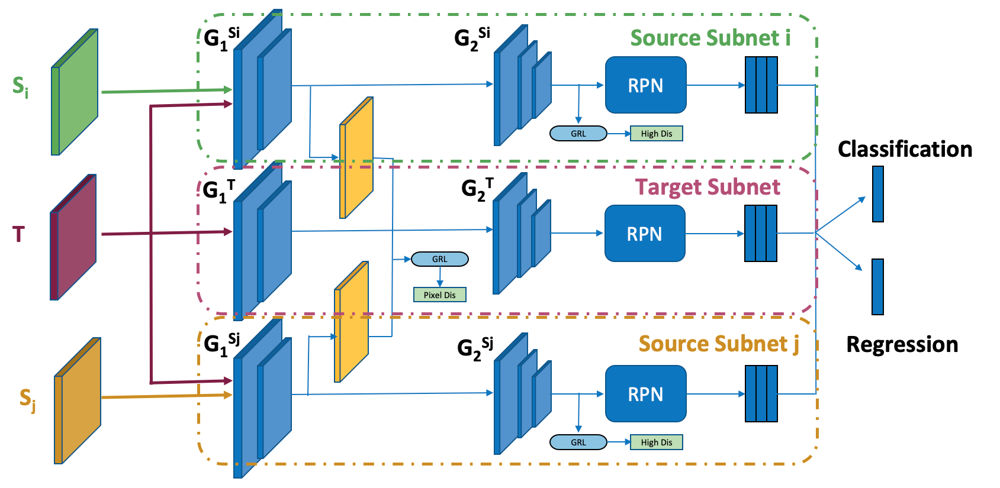
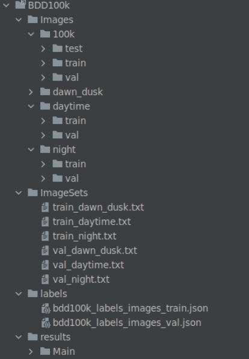
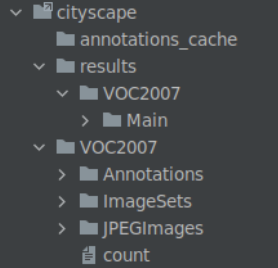
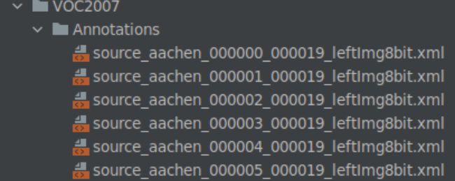
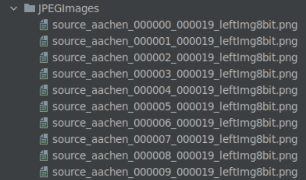
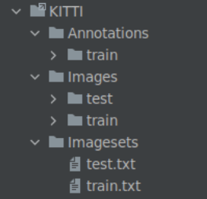

# DSN_GITHUB
This is the PyTorch implementation of our paper:  
Domain specific network for Multi-source domain adaptation 

# Installation

## Prerequisites

- Python ≥ 3.6.7
- PyTorch ≥ 1.7.1 and torchvision that matches the PyTorch installation.
- torchvison ≥  0.8.2

## Install python env
cd DSN_GITHUB/lib
python setup.py build develop

# DATASET

## BDD100k
Dataset folder

## Cityscape
Dataset folder
	

  
Annotations name
	

  
Images name

	
## KITTI
Dataset folder
      

		

# Trainning
Run train_msda.sh file as follows. 

sh train_msda.sh

In the train_msda.sh file:
  
  save_dir: the directory where save the check_point file
  
  dataset: 
  
  + mskda_bdd for cross time dataset
    
  + mskda_car for cross camera dataset
  
  net: backbone net is used: vgg16
  
  pretrained_path: the path of vgg16 pretraining file at caffe
  
  Max_epoch: 25
  
  burn_in : 10 the burn in epoch
  
  CUDA_VISIBLE_DEVICES=3: the thirdGPU will be used
  
  train_msda.py: the name of training file:
    
  +  train_msda.py: training with hyperparameter same the paper
    
  +  train_msda_confidenceloss.py: we change the consistency loss lead the good accuracy
    
  +  train_msda_strongaug.py:	we train method with strong augmentation lead a good accuracy for cross camera dataset

train_msda_bdd.txt: detail of training process will be saved here

# Test

  
  We run the test_msda.py file.
  
  part: test_t: we only test at target dataset
  
  Dataset:
    
  +  mskda_bdd for cross time dataset
    
  +  mskda_car for cross camera dataset
  
  path: The path of folder that save the check_point file
  
  start_epoch and max_epochs: will be test
  
  os.environ["CUDA_VISIBLE_DEVICES"]="2": the order of the GPU will be used to test
  
  model_dir: the path of check_point file
  
  test_msda.py: the file of evaluation will be used to test
